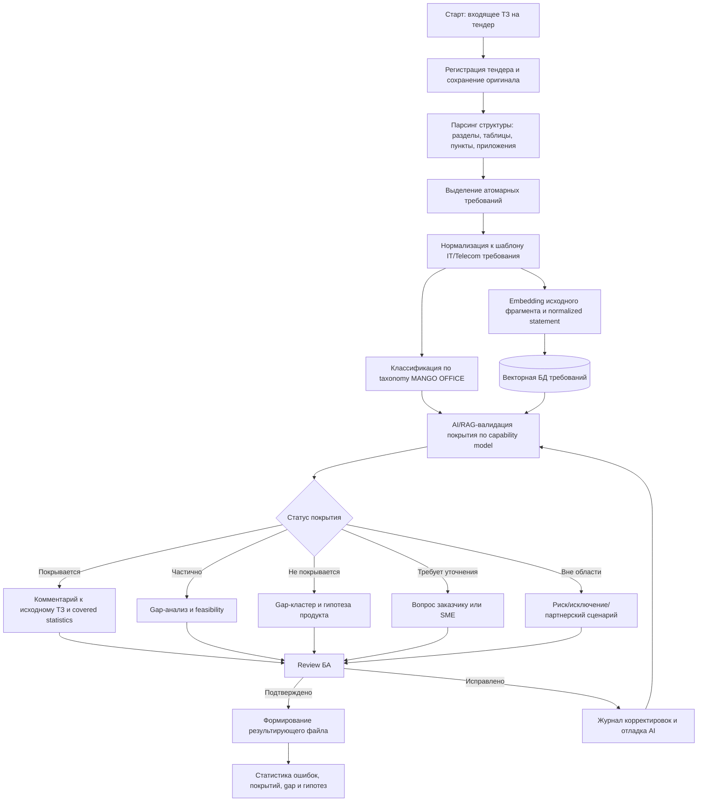
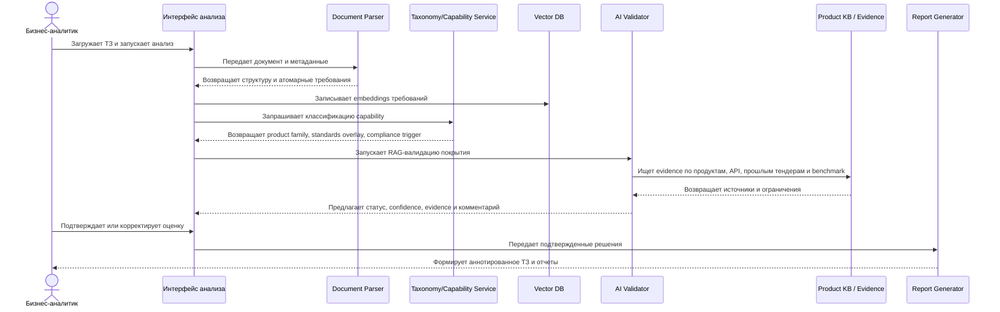
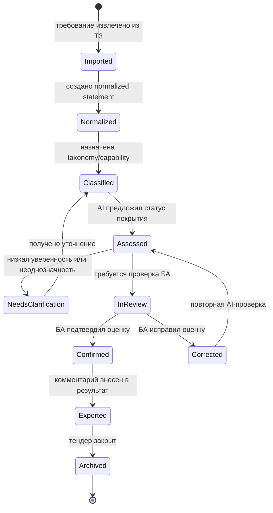
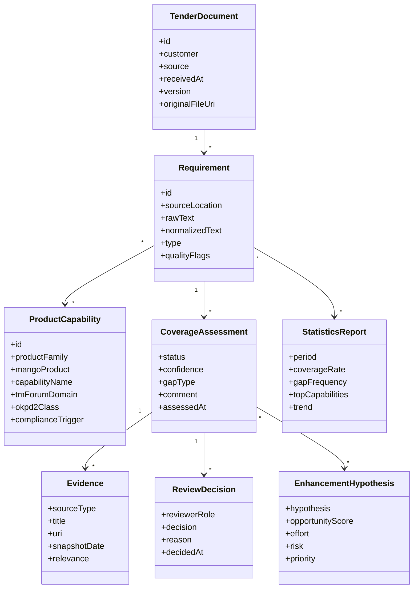

# Flow требований для AI-анализа тендерных ТЗ MANGO OFFICE

Версия: 1

Дата среза: 22 мая 2026 г.

Цель документа: сформулировать функциональные требования и целевой flow системы, которая помогает бизнес-аналитику MANGO OFFICE анализировать входящие тендерные ТЗ, проверять покрытие требований продуктами MANGO OFFICE, выявлять частично покрытые и непокрытые требования, формировать статистику спроса на функциональность и готовить гипотезы продуктовых доработок.

Связанный документ: [Классификация IT/Telecom SaaS-продуктов MANGO OFFICE](classification.md).

## Краткий вывод

Система должна работать как аналитический контур поверх тендерных документов, продуктового каталога MANGO OFFICE, базы требований, векторного индекса и экспертной проверки БА. Основной результат работы - исходное ТЗ с комментариями о покрытии функциональности, реестр атомарных требований, статистика спроса по продуктовым capability и набор гипотез для развития UCaaS, CCaaS, CPaaS, AI, аналитики и интеграций.

Ключевые принципы flow:

1. Исходный документ не теряется и не переписывается: система хранит оригинал, структуру документа, извлеченные фрагменты и связи с атомарными требованиями.
2. Каждое требование нормализуется до проверяемой формулировки по терминологии IT/Telecom и получает классификацию из `classification.md`: продуктовая зона, capability, статус MANGO OFFICE, TM Forum domain/capability, UNSPSC/ОКПД 2 и compliance-trigger.
3. AI-компонент не должен выдавать бездоказательную оценку. Для каждого статуса покрытия нужна ссылка на источники: продуктовый каталог, knowledge base, матрицу capability, внутренний комментарий БА или конкурентный benchmark.
4. БА остается владельцем финального решения: система предлагает статус, аргументы и уверенность, а БА подтверждает, исправляет или отправляет требование на уточнение.
5. Корректировки БА используются как управляемая обратная связь: они попадают в журнал обучения/отладки промптов, но не меняют production-логику без review, версии и regression-проверки.

## Термины и рабочая модель

| Термин | Рабочее определение для проекта |
| --- | --- |
| Входящее ТЗ | Тендерный документ или комплект документов заказчика с требованиями к коммуникационной системе, контакт-центру, интеграциям, аналитике, безопасности и сервисной поддержке. |
| Комплекс требований | Полный набор требований одного тендера с сохранением структуры исходного ТЗ: разделы, пункты, таблицы, приложения, номера строк и исходные формулировки. |
| Атомарное требование | Минимальная проверяемая формулировка, описывающая одну capability, ограничение, интеграцию, показатель качества, compliance-условие или сценарий пользователя. |
| Нормализация требования | Приведение исходного текста к единому языку IT/Telecom и BA: субъект, действие, объект, условие, измеримый результат, источник и границы применимости. |
| Product capability | Возможность продукта или сервиса MANGO OFFICE, которую можно сопоставить с требованием: например IVR, skill-based routing, запись разговоров, речевая аналитика, API, WFM, QM, CPaaS. |
| Статус покрытия | Решение по требованию: `Покрывается`, `Частично покрывается`, `Не покрывается`, `Требует уточнения`, `Вне области MANGO OFFICE`. |
| Gap | Разрыв между требованием заказчика и текущей capability MANGO OFFICE: отсутствующая функция, ограничение тарифа/модуля, интеграционный пробел, compliance-ограничение или операционная зависимость. |
| Feasibility | Оценка реализуемости доработки: продуктовая целесообразность, техническая сложность, зависимость от платформы/оператора/партнера, риски ИБ/ПДн и ожидаемый эффект. |
| Evidence | Доказательная база оценки: ссылка на каталог, документацию, API, классификацию, внутреннюю базу знаний, отчет конкурента, комментарий SME или решение БА. |

## Нормализация исходных ФТ

| Исходная формулировка | Нормализованная формулировка в терминологии IT/Telecom |
| --- | --- |
| Система должна обеспечивать валидацию комплекса требований к системе на основе тендерной заявки. | Система должна извлекать, нормализовать, классифицировать и оценивать полный набор требований входящего тендерного ТЗ относительно продуктового каталога и capability model MANGO OFFICE. |
| Система должна обеспечивать проверку определенного требования на доступность и функциональность в системе. | Система должна поддерживать проверку одного атомарного требования по статусу покрытия, продуктовой зоне, доступной функциональности, ограничениям тарифа/модуля, интеграционным зависимостям и evidence. |
| Система должна позволять пользователю проверять требования на возможность доработки с учетом best practice и стандартов. | Система должна формировать gap/feasibility-оценку для частично покрытых и непокрытых требований с учетом ISO/IEC/IEEE 29148, BABOK, TM Forum, ITIL/ISO 20000, российских ГОСТ/НПА и продуктовых практик discovery. |
| Система должна предоставлять статистику по требованиям, которые покрываются продуктами Манго офис. | Система должна агрегировать статистику покрытых требований по продуктовым семействам, capability, сегментам заказчиков, источникам ТЗ, частотности, win/loss-контексту и динамике спроса. |
| Система должна предоставлять статистику по требованиям, которые не покрываются продуктами Манго офис. | Система должна агрегировать статистику gap-требований по отсутствующим capability, частоте запроса, бизнес-ценности, продуктовой зоне, технической реализуемости и приоритету для roadmap. |
| Система должна анализировать гипотезы о доработке продуктов на основе отчетов конкурентов и статистики требований. | Система должна связывать gap-статистику, competitor benchmark и внутренние продуктовые ограничения в гипотезы развития MANGO OFFICE с оценкой эффекта, effort, рисков и evidence. |

## Функциональные требования

| ID | Функциональное требование | Основной результат |
| --- | --- | --- |
| FR-01 | Система должна принимать тендерное ТЗ в форматах DOCX, PDF, XLSX, HTML и plain text, регистрировать документ, источник, дату получения, заказчика, версию и ответственного БА. | Карточка тендера и неизменяемый оригинал документа. |
| FR-02 | Система должна сохранять структуру исходного документа: разделы, пункты, таблицы, приложения, номера страниц, номера строк и исходные фрагменты текста. | Трассировка от атомарного требования к месту в исходном ТЗ. |
| FR-03 | Система должна выделять логически атомарные требования и отделять функциональные требования от NFR, compliance-условий, коммерческих условий, SLA, интеграций и ограничений поставки. | Реестр атомарных требований с типом требования. |
| FR-04 | Система должна нормализовать требования к стандартному шаблону: субъект, действие, объект, условие, измеримый результат, исключения, источник и критерий проверки. | Проверяемая формулировка требования. |
| FR-05 | Система должна создавать embedding исходного фрагмента и нормализованного требования, записывать векторное представление в векторную БД и поддерживать повторный поиск похожих требований. | Векторный индекс требований и дубликатов. |
| FR-06 | Система должна классифицировать требования по рабочей таксономии MANGO OFFICE из `classification.md`: product family, Mango status, Mango product, TM Forum domain/capability, UNSPSC, ОКПД 2, standards overlay и compliance trigger. | Классифицированное требование. |
| FR-07 | Система должна проверять покрытие каждого требования по продуктовым capability MANGO OFFICE и присваивать статус `Покрывается`, `Частично покрывается`, `Не покрывается`, `Требует уточнения` или `Вне области MANGO OFFICE`. | Оценка покрытия по каждому требованию. |
| FR-08 | Система должна объяснять оценку покрытия через evidence: продуктовую страницу, API/документацию, capability model, внутреннюю базу знаний, предыдущие тендеры, экспертный комментарий или конкурентный отчет. | Обоснование, пригодное для review БА. |
| FR-09 | Система должна рассчитывать уверенность AI-оценки и отправлять требования с низкой уверенностью, конфликтующими evidence или высокой критичностью на обязательную проверку БА. | Очередь экспертной проверки. |
| FR-10 | Система должна формировать комментарии к исходному ТЗ без нарушения структуры документа: статус покрытия, краткое объяснение, продукт MANGO OFFICE, gap, вопрос на уточнение или рекомендация по доработке. | Аннотированный файл для тендерной работы. |
| FR-11 | Система должна поддерживать review-flow БА: подтверждение оценки, корректировка статуса, изменение классификации, добавление evidence, фиксация замечания и возврат требования на повторный анализ. | Подтвержденный результат анализа. |
| FR-12 | Система должна передавать подтвержденные корректировки БА в контур отладки AI: журнал ошибок, тип ошибки, исходный prompt/version, expected output, фактический output и решение reviewer. | Данные для controlled prompt/model improvement. |
| FR-13 | Система должна формировать статистику покрытых требований по продуктам, capability, тендерам, сегментам заказчиков, частоте запроса и доле покрытия тендерного ТЗ. | Аналитика product-fit и tender-fit. |
| FR-14 | Система должна формировать статистику непокрытых и частично покрытых требований по gap-категориям, частотности, потенциальной выручке, сложности и связи с competitor benchmark. | Backlog возможностей для discovery и roadmap. |
| FR-15 | Система должна поддерживать анализ гипотез доработки: формулировка гипотезы, связанная gap-группа, целевой продукт, ожидаемый эффект, effort, риски, dependency, compliance-impact и priority score. | Гипотезы продуктового развития. |
| FR-16 | Система должна формировать итоговые отчеты: executive summary, матрица покрытия, список gap, вопросы заказчику, риски участия в тендере, статистика и рекомендации для product owner. | Комплект выходных материалов. |
| FR-17 | Система должна вести аудит действий, версионирование результатов анализа, историю решений БА и связи между исходным текстом, нормализованным требованием, AI-оценкой и финальным решением. | Traceability и воспроизводимость анализа. |
| FR-18 | Система должна применять правила безопасности и compliance: маскирование ПДн при необходимости, разграничение доступа, журналирование, контроль выгрузок, сроки хранения и пометки `ПДн`, `реклама`, `услуга связи`, `КИИ`. | Управляемая обработка чувствительных данных. |

## Дополнительные ФТ с учетом best practice

| ID | Дополнительное требование | Практика, которую закрывает |
| --- | --- | --- |
| BPR-01 | Система должна проверять качество формулировки требования по критериям однозначности, атомарности, проверяемости, полноты условий и отсутствия скрытых решений. | Requirements quality по ISO/IEC/IEEE 29148 и BABOK. |
| BPR-02 | Система должна отделять потребность заказчика от предлагаемого решения и фиксировать solution-neutral формулировку, если исходное ТЗ содержит vendor-specific или технически предвзятый текст. | Business analysis и product discovery. |
| BPR-03 | Система должна выявлять дубликаты, близкие требования и повторяющиеся паттерны между тендерами через semantic search и кластеризацию. | Управление knowledge base и частотностью спроса. |
| BPR-04 | Система должна фиксировать конфликтующие требования внутри одного ТЗ: несовместимые SLA, взаимоисключающие каналы, противоречия по хранению данных, ИБ или интеграциям. | Requirements validation. |
| BPR-05 | Система должна формировать вопросы на уточнение заказчику, если требование не имеет измеримого критерия приемки, содержит неопределенные термины или зависит от внешней системы. | Clarification backlog и tender Q&A. |
| BPR-06 | Система должна поддерживать версионирование taxonomy/capability model, чтобы результат анализа можно было воспроизвести на версии каталога, актуальной на дату тендера. | Auditability и model governance. |
| BPR-07 | Система должна связывать требования с NFR: доступность, производительность, масштабируемость, отказоустойчивость, безопасность, observability, переносимость данных и UX рабочего места оператора. | ISO/IEC 25010, ITIL/ISO 20000, cloud/SaaS practice. |
| BPR-08 | Система должна считать opportunity score для gap-групп: frequency, revenue potential, strategic fit, competitor parity, effort, risk и compliance impact. | Product roadmap prioritization, RICE/WSJF-подобная оценка. |
| BPR-09 | Система должна поддерживать red-team/review режим для AI-оценок: поиск слабых evidence, hallucination-risk, unsupported claims и чрезмерно оптимистичных статусов покрытия. | Responsible AI и quality assurance. |
| BPR-10 | Система должна хранить benchmark конкурентов как отдельный источник evidence с датой среза, ссылкой, продуктом конкурента, capability и уровнем уверенности. | Competitive intelligence governance. |
| BPR-11 | Система должна формировать lessons learned после завершения тендера: какие требования повлияли на решение, какие gap стали критичными, какие оценки AI/БА были изменены. | Continuous improvement. |
| BPR-12 | Система должна поддерживать роли `БА`, `Product Owner`, `SME`, `ИБ/Legal reviewer`, `Sales/Tender manager` и разные права на подтверждение статусов, compliance-выводов и roadmap-гипотез. | Разделение ответственности и контроль решений. |

## Матрица кейсов

| ID | Актор и цель | Вход | Основной сценарий | Выход | Связанные ФТ |
| --- | --- | --- | --- | --- | --- |
| UC-01 | Tender manager загружает входящее ТЗ. | DOCX/PDF/XLSX, карточка клиента. | Загрузить файл, указать источник, тендер, клиента, дату, ответственного БА. | Зарегистрированный тендер и сохраненный оригинал. | FR-01, FR-02, FR-18 |
| UC-02 | БА получает реестр атомарных требований. | Зарегистрированное ТЗ. | Система парсит структуру, извлекает пункты, делит составные формулировки, определяет тип требования. | Таблица атомарных требований с ссылкой на исходный пункт. | FR-02, FR-03, FR-04 |
| UC-03 | БА проверяет весь комплекс требований на tender-fit. | Реестр требований и capability model. | Система классифицирует требования, ищет evidence, назначает статус покрытия, считает долю покрытия. | Матрица покрытия тендера и summary по участию. | FR-06, FR-07, FR-08, FR-13, FR-16 |
| UC-04 | БА проверяет одно критичное требование. | Номер пункта или текст требования. | Система показывает normalized statement, product capability, evidence, статус, confidence, ограничения и вопросы. | Решение по одному требованию. | FR-04, FR-07, FR-08, FR-09 |
| UC-05 | Product Owner анализирует частично покрытые требования. | Требования со статусом `Частично покрывается`. | Система группирует gap, показывает недостающую capability, ограничения текущего продукта и частоту запроса. | Список улучшений текущего продукта. | FR-14, FR-15, BPR-08 |
| UC-06 | Product Owner анализирует непокрытые требования. | Требования со статусом `Не покрывается`. | Система строит gap-кластеры, связывает с конкурентами, оценивает frequency/revenue/effort/risk. | Backlog гипотез развития или out-of-scope решение. | FR-14, FR-15, BPR-10 |
| UC-07 | БА уточняет неоднозначное требование. | Низкая уверенность, неясный текст, конфликт evidence. | Система показывает причину неопределенности и формирует вопрос заказчику или SME. | Clarification question и статус `Требует уточнения`. | FR-09, BPR-05 |
| UC-08 | ИБ/Legal reviewer проверяет compliance-trigger. | Требования с `ПДн`, `реклама`, `услуга связи`, `КИИ`. | Reviewer проверяет правовые основания, хранение, доступы, журналы, согласия и ограничения. | Compliance-комментарий и условия участия. | FR-18, BPR-12 |
| UC-09 | БА корректирует AI-оценку. | Предложенная AI-оценка и evidence. | БА меняет статус, классификацию или комментарий, добавляет expected output и причину ошибки. | Подтвержденное решение и запись для отладки. | FR-11, FR-12, FR-17 |
| UC-10 | Руководитель БА смотрит статистику покрытых требований. | Набор тендеров за период. | Система агрегирует covered-rate по продуктам, сегментам, capability, каналам продаж и датам. | Dashboard product-fit. | FR-13, FR-16 |
| UC-11 | Product team смотрит статистику gap. | Непокрытые и частично покрытые требования за период. | Система считает частоту, trend, ARR/revenue proxy, competitor parity, risk и priority score. | Product discovery report. | FR-14, FR-15, BPR-08 |
| UC-12 | Tender manager формирует итоговый файл. | Подтвержденная матрица покрытия. | Система вставляет комментарии в копию исходного ТЗ, формирует summary, gap-list и вопросы заказчику. | Аннотированное ТЗ и аналитический отчет. | FR-10, FR-16, FR-17 |
| UC-13 | AI owner улучшает промпты. | Журнал ошибок и корректировок БА. | Система группирует ошибки, готовит regression-набор, тестирует новую версию промпта до публикации. | Версионированное улучшение AI-контура. | FR-12, BPR-09, BPR-11 |
| UC-14 | BA/PO сравнивает похожие тендеры. | Новое требование или тендер. | Система ищет похожие требования в векторной БД и показывает предыдущие решения и outcomes. | Reuse previous analysis и снижение ручной работы. | FR-05, BPR-03, BPR-11 |

## Матрица статусов покрытия

| Статус | Когда применять | Что должно быть в комментарии к ТЗ | Следующее действие |
| --- | --- | --- | --- |
| `Покрывается` | Capability доступна в продукте MANGO OFFICE без существенной доработки и подтверждена evidence. | Название продукта, capability, ссылка/evidence, возможные условия тарифа или настройки. | Включить в covered-rate и финальный отчет. |
| `Частично покрывается` | Есть близкая capability, но не хватает функции, масштаба, канала, API, SLA, UX, отчета или compliance-условия. | Что покрывается, что не покрывается, workaround, риск и необходимость доработки. | Отправить в gap-анализ и при необходимости Product Owner. |
| `Не покрывается` | В текущем каталоге и capability model нет функции или сервисной возможности. | Краткий gap, предполагаемая продуктовая зона, competitor/evidence при наличии. | Добавить в backlog гипотез или пометить out-of-scope. |
| `Требует уточнения` | Требование неоднозначно, непроверяемо, противоречиво или зависит от внешних условий. | Вопрос заказчику/SME и причина, почему статус нельзя определить. | Вернуть в tender Q&A или SME-review. |
| `Вне области MANGO OFFICE` | Требование относится к аппаратной поставке, непрофильной ИТ-системе, внутреннему процессу заказчика или услуге вне продуктового контура. | Объяснение границы ответственности и возможный партнерский/интеграционный сценарий. | Исключить из product-fit или вынести в риск/условие поставки. |

## End-to-end flow

## Sequence: анализ требования

## State machine: жизненный цикл требования

## Data model: основные сущности

## Flow требований по этапам

| Этап | Цель | Вход | Обработка | Выход | Контроль качества |
| --- | --- | --- | --- | --- | --- |
| 1. Старт: входящее ТЗ | Зафиксировать тендер и исходный документ. | ТЗ на тендер, метаданные клиента. | Регистрация, сохранение оригинала, назначение БА, проверка формата. | Карточка тендера, immutable original. | Проверка читаемости и полноты комплекта. |
| 2. Нормализация ТЗ к стандарту | Создать единый аналитический слой поверх разных форматов ТЗ. | Исходный документ. | Парсинг структуры, OCR при необходимости, выделение разделов, таблиц и пунктов. | Структурированное представление документа. | Сверка числа разделов/таблиц с исходником. |
| 3. Создание векторного представления | Обеспечить semantic search, поиск повторов и reuse прошлых решений. | Исходные фрагменты и normalized statements. | Embedding, запись в vector DB, привязка к версии модели и taxonomy. | Индекс требований и похожих кейсов. | Контроль версии embedding-модели и дедупликация. |
| 4. Разметка атомарных требований | Не потерять требования и не смешать разные capability в одном пункте. | Структурированный документ. | Деление составных требований, типизация, сохранение sourceLocation. | Реестр атомарных требований. | Проверка атомарности, полноты и traceability. |
| 5. AI-валидация покрытия | Получить предварительную оценку tender-fit. | Реестр требований, taxonomy, product KB, vector DB. | RAG-поиск evidence, classification, status assignment, confidence scoring. | Предложенная матрица покрытия. | Evidence required, confidence threshold, hallucination check. |
| 6. Формирование комментариев к ТЗ | Подготовить результат в структуре, удобной для тендерной работы. | Матрица покрытия и исходная структура ТЗ. | Генерация кратких комментариев, вопросов, gap и ссылок на продукты. | Аннотированное ТЗ или отдельный файл комментариев. | Комментарий не должен искажать исходное требование. |
| 7. Review БА | Подтвердить экспертное решение. | AI-оценки, evidence, comments. | Подтверждение, исправление, отправка на уточнение, добавление SME/legal review. | Финальная матрица покрытия. | Обязательный review низкой уверенности и compliance-trigger. |
| 8. Контур отладки AI | Улучшать качество без неконтролируемого изменения production-логики. | Корректировки БА, ошибки, expected outputs. | Классификация ошибок, regression set, prompt/model evaluation, versioning. | Улучшенные промпты/правила после review. | Approval, changelog, regression-проверка. |
| 9. Статистика требований | Дать управленческую аналитику по спросу и покрытию. | Подтвержденные требования за период. | Агрегация coverage, gap, frequency, trend, product family, segment. | Dashboard и аналитический отчет. | Исключение дублей и учет версии taxonomy. |
| 10. Гипотезы развития | Перевести gap в product discovery. | Gap-статистика, competitor benchmark, PO inputs. | Кластеризация, opportunity scoring, risk/effort/compliance оценка. | Roadmap-гипотезы и discovery backlog. | Проверка источников и business case. |

## Требования к результирующим артефактам

1. Аннотированное ТЗ должно сохранять структуру исходного документа и добавлять комментарии по пунктам требований без удаления или переформулирования текста заказчика.
2. Матрица покрытия должна содержать минимум: ID требования, исходный пункт, normalized statement, тип требования, product family, product capability, статус покрытия, confidence, evidence, комментарий БА, gap и следующий шаг.
3. Статистический отчет должен показывать covered-rate по тендеру, топ покрытых capability, топ gap, требования с compliance-trigger, требования с низкой уверенностью и потенциальные вопросы заказчику.
4. Product discovery report должен группировать gap по capability и показывать frequency, affected tenders, segment, potential value, competitor parity, implementation effort, risk и priority.
5. Журнал отладки AI должен позволять восстановить, какой prompt/model/taxonomy дал исходную оценку и какая корректировка БА была применена.

## Acceptance criteria для первой версии

| ID | Критерий приемки |
| --- | --- |
| AC-01 | Для одного входящего ТЗ система формирует реестр атомарных требований с ссылкой на исходный пункт документа. |
| AC-02 | Для каждого требования система присваивает один из пяти статусов покрытия и показывает evidence или причину отсутствия evidence. |
| AC-03 | БА может изменить статус и комментарий, а система сохраняет отличие AI-оценки от финального решения. |
| AC-04 | Система формирует процент покрытия тендерного ТЗ по всем требованиям и отдельно по функциональным требованиям. |
| AC-05 | Система формирует список непокрытых и частично покрытых требований, сгруппированных по product family и capability. |
| AC-06 | Система формирует вопросы заказчику для требований со статусом `Требует уточнения`. |
| AC-07 | Система формирует аннотированный результат без изменения исходного текста требования. |
| AC-08 | Для требований с `ПДн`, `реклама`, `услуга связи` или `КИИ` система добавляет compliance-trigger и отправляет их на review. |
| AC-09 | Корректировки БА доступны в журнале ошибок AI и могут использоваться в regression-наборе для проверки новой версии промпта. |
| AC-10 | Статистика по требованиям может быть агрегирована минимум по периоду, продуктовой зоне, capability, статусу покрытия и тендеру. |

## Риски и ограничения

| Риск | Последствие | Митигирующее требование |
| --- | --- | --- |
| AI переоценивает покрытие продукта. | Ошибочное решение по участию в тендере или обещание недоступной функции. | Evidence required, confidence threshold, review БА, red-team режим. |
| Исходное ТЗ плохо структурировано или содержит сканы. | Потеря требований, неверная sourceLocation. | OCR, контроль полноты, ручная проверка структуры. |
| Требование содержит ПДн, коммерческую тайну или чувствительные данные. | Нарушение обработки данных и ограничений доступа. | Маскирование, RBAC, аудит, retention policy, compliance-trigger. |
| Taxonomy устарела относительно продуктового каталога. | Неверная классификация и статистика. | Версионирование taxonomy/capability model и дата среза. |
| Competitor benchmark не имеет надежного источника. | Некорректная гипотеза развития. | Источник, дата среза, confidence, review Product Owner. |
| Корректировки БА автоматически ухудшают prompt. | Regression в новых анализах. | Controlled AI improvement, regression set, approval перед публикацией. |

## Источники и стандарты

- MANGO OFFICE, публичный каталог продуктов: <https://www.mango-office.ru/products/>
- MANGO OFFICE, Контакт-центр: <https://www.mango-office.ru/products/contact-center/>
- MANGO OFFICE, Голосовой робот: <https://www.mango-office.ru/products/contact-center/ai/voice-robot/>
- MANGO OFFICE, API: <https://www.mango-office.ru/support/api/ob_api_mango_office/>
- TM Forum, Open Digital Architecture: <https://www.tmforum.org/open-digital-architecture/>
- TM Forum, Business Process Framework (eTOM): <https://www.tmforum.org/business-process-framework/>
- TM Forum, Information Framework (SID): <https://www.tmforum.org/oda/information-systems/information-framework-sid/>
- ISO, ISO/IEC/IEEE 29148:2018 Requirements engineering: <https://www.iso.org/standard/72089.html>
- IIBA, BABOK Guide and business analysis standards: <https://www.iiba.org/standards-and-resources/babok/>
- PeopleCert, ITIL 4 practices: <https://www.peoplecert.org/ITIL4-practices>
- ISO, ISO/IEC 20000-1 service management system requirements: <https://www.iso.org/standard/70636.html>
- ГОСТ Р 55540-2013 по качеству услуги центра обработки вызовов: <https://docs.cntd.ru/document/1200106675>
- Федеральный закон N 126-ФЗ "О связи": <https://www.consultant.ru/document/cons_doc_LAW_43224/>
- Федеральный закон N 152-ФЗ "О персональных данных": <https://www.consultant.ru/document/cons_doc_LAW_61801/>
